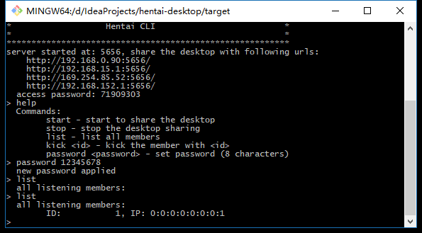
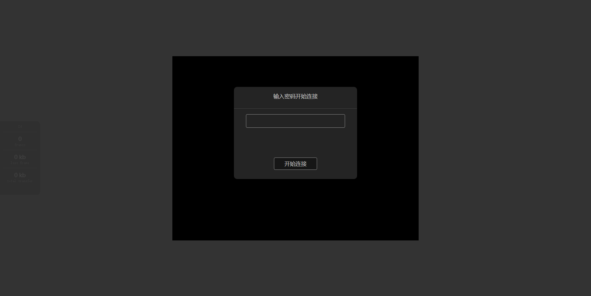
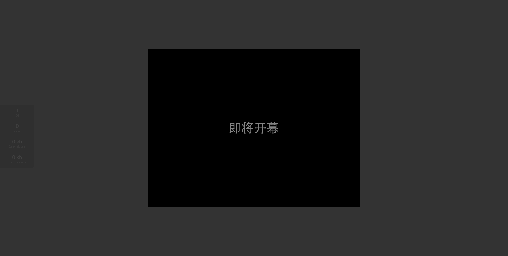

## 桌面共享（局域网会议）
小型IT企业开会比较随便，经常就在工位上就进行了，也懒得去会议室，所以这时候通常需要一款能够分享屏幕的工具。之前用过QQ的多人桌面共享，以及Teamviewer的会议功能，因为这两者都需要经过远程服务器中转，效果相当的不理想，比如QQ的画质堪忧，Teamviewer收费，而且两者都有很严重的画面不同步的问题。
既然都在同一个局域网内了，那带宽起码是100Mb起步吧，所以我把tentacle远程桌面改了改，改为一款分享自己桌面到其他人的一款应用，开会效果倍儿棒~~~

### 主持人
1. 直接启动`cn.org.hentai.desktop.app.ServerApp`即可（也可以打包成jar包，创建一个bat批处理启动更方便）。
2. 启动成功后，会显示当前主机的IP（如果有多网卡将会显示列出）以及所监听的端口、访问密码等，可以通过浏览器直接访问来观看共享的屏幕画面。
3. 之后会进入一个简易的CLI命令行交互过程中，可以通过如下命令完成运行中的控制：
	1. `password <text>`，设置访问密码，8位字符
	2. `list`，列出当前所有已经连接并且输入了正确密码的客户端。
	3. `kick <id>`，踢除指定ID的客户端，停止其画面同步。
	4. `start`，开始画面共享。
	5. `stop`，停止画面共享。
	6. `exit`，退出屏幕共享工具，结束进程。

### 参会者/客户端
参与会议者在浏览器中打开CLI中显示的IP地址以及相应的端口（完整的网址如上图所示），将会显示如下界面，输入CLI自动创建的或是主持人修改后的密码，将会进入到会议中来，在主持人开始启动会议后，即可看到主持人方的屏幕画面。

如果某客户端在开始共享之后才加入，画面将会是花屏的，这时候可以通过在CLI里输入`stop`、`start`来强制刷新全屏画面来修正过来。

另外，此工具改得比较仓促，就将就着用吧，反正我已经用了大半年了。